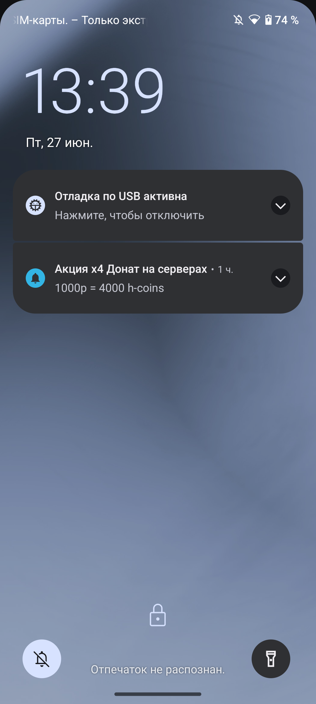

<h1 align="center">🚀 Dream MTA</h1>

<p align="center">
  <strong>Проект модификации для Multi Theft Auto</strong><br>
  Исходники и ресурсы для сервера Dream MTA
</p>

<p align="center">
  
</p>

---

## 📋 О проекте

Dream MTA — это модификация для Multi Theft Auto (MTA), созданная для улучшения игрового процесса и добавления новых возможностей.

### Особенности:
- Качественные скрипты на Lua/PAWN
- Оптимизация под многопользовательскую игру
- Активная поддержка и обновления
- Простой и понятный код для разработчиков

---

## 🚀 Как начать

1. Склонируй репозиторий:
```bash
git clone https://github.com/SemTab/dream_mta.git
